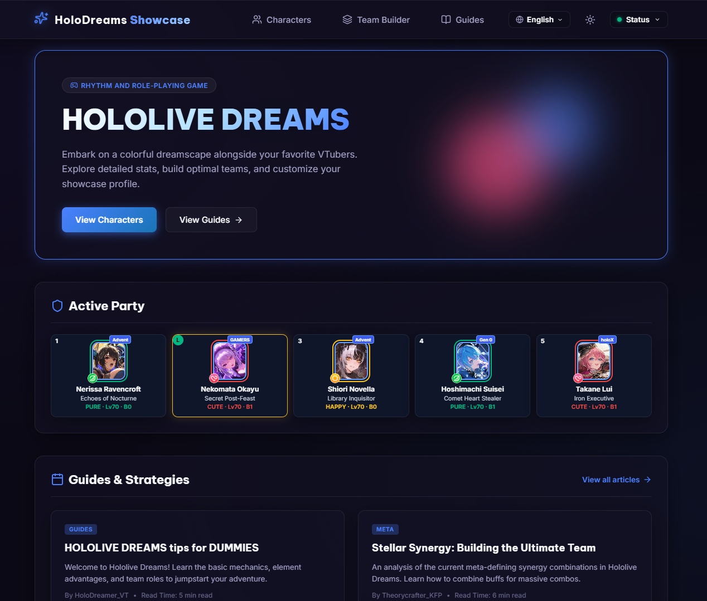

# HoloDreams Showcase — Hololive Dreams Database, Guides & Team Builder

A full-stack fan-made web app for the game Hololive Dreams: focus on card database and an interactive team builder with real scoring engine team recommendations.

<p align="center">
  
</p>

> Fan project. All Hololive production assets and characters belong to COVER Corp.

## Features

### Team Builder & Optimizer

- **Interactive 5-member team editor** with per-slot card variant, Bloom stage and Level controls
- **Drag & drop everywhere**: reorder team units, assign a leader from the team, move the leader into the team — works with mouse, touch and pen (HTML5 DnD + pointer-event fallback)
- **Live scoring** of the current team: Expected Index, stat breakdowns, active/special/SAR contributions and per-member math
- **Outfit-leader system** — assign any owned (or external) character as leader to apply their outfit skill, with active/inactive validation against the team composition
- **"Best Position"** — finds the 5-slot arrangement that maximizes the current leader's score across all 120 permutations
- **Smart Suggest / Recommendation engine** — ported Holodori Optimizer beam-search worker finds the top 10 teams from your owned roster, or the best next card to pull
- **5 presets** per device with roster ownership, auto-persisted to the backend

### Database, Guides & Admin

- **Character/Card database** — every talent and card variant with stats, skills, type/group tags, rarity filters and artwork
- **Multi-language blog & guides** (11 languages) — localized Markdown content with dynamic loading
- **Admin dashboard** — manage characters/cards and guides (CRUD + bulk import), image uploads, sync from the HolodoriDB snapshot

## Tech Stack

| Layer     | Tech                                                              |
| --------- | ----------------------------------------------------------------- |
| Frontend  | React 19, Vite 8, React Router 7, Lucide icons                     |
| Backend   | Node.js, **TypeScript**, Express 5                                  |
| Data      | PostgreSQL (prod, via `pg`) with a JSON-file store fallback for dev |
| Validation| zod                                                               |
| Logging   | pino (structured JSON + request IDs)                               |
| Events    | Kafka (KRaft) — catalog sync → search-index worker                  |
| Tooling   | Oxlint, Playwright (E2E), tsx, `concurrently`                     |
| Deploy    | Vercel (frontend) + Node backend (CodeSandbox/Code.run)            |

## Architecture

```
hololive-dream/
├── backend/               # Node/Express + TypeScript API server
│   ├── tsconfig.json      # TS config (compiles src -> dist)
│   ├── src/
│   │   ├── server.ts      # Entrypoint: bootstrap + listen + graceful shutdown
│   │   ├── worker.ts      # Kafka consumer: rebuilds search index on catalog.synced
│   │   ├── app.ts         # Express wiring + middleware registration
│   │   ├── config.ts      # Env/config (DATABASE_URL, KAFKA_BROKERS, ADMIN_PASSWORD…)
│   │   ├── logger.ts      # pino instance
│   │   ├── db/            # postgres.ts (pool, schema, seed) + jsonStore.ts (dev store)
│   │   ├── repositories/  # SQL access layer (character, preset, roster, guide, search, meta)
│   │   ├── services/      # business logic (character, preset, roster, guide, sync, auth)
│   │   ├── controllers/   # thin HTTP layer per resource
│   │   ├── routes/        # health, characters, songs, presets, roster, guides, admin, docs
│   │   ├── middleware/    # requestLogger, errorHandler, validate, rateLimit, requireAdmin…
│   │   ├── schemas/       # zod request schemas
│   │   ├── kafka/         # producer.ts (catalog.synced) + consumer.ts (index rebuild)
│   │   └── etl/           # HolodoriDB snapshot sync + card-art extraction scripts
│   ├── tests/             # integration tests (node:test + tsx)
│   ├── database.json      # Dev-mode JSON data store (PostgreSQL in prod)
│   └── dist/              # Compiled output (gitignored)
├── frontend/              # Vite + React 19 app
│   ├── src/
│   │   ├── components/    # TeamBuilder, CharacterDB, Guides, AdminDashboard, Home, Navbar
│   │   ├── search_worker.js   # Ported Holodori Optimizer engine (Web Worker)
│   │   ├── allCards.js        # Builds the card pool from raw character data
│   │   └── context/           # i18n — 11 languages, URL-prefixed routes
│   └── dist/              # Production build output
├── tests/e2e/             # Playwright smoke tests
├── gatus/                 # Uptime/health monitoring config
├── vercel.json            # Vercel deployment config (frontend + API rewrites)
├── docker-compose.yml     # db + backend + frontend (+ kafka + worker behind --profile kafka)
└── package.json           # Root scripts: dev / build / start / lint / test
```

The scoring kernel is derived from **[holodori-optimizer](https://github.com/ace-ks-dev/holodori-optimizer)** and adapted to run both in-app (live team scoring) and inside a Web Worker (team search/recommendation).

> **Licensing note:** upstream currently publishes holodori-optimizer under an *all rights reserved* notice (no open-source licence for its original source code). See [NOTICE.md](NOTICE.md) for all third-party material and `docs/permission-request.md` for a ready-to-send request. Get the upstream author's written permission — or replace the vendored scoring code with your own implementation — before distributing this project publicly. Card data is built directly from the [HolodoriDB](https://github.com/HolodoriDB/holodori-db-eng-diff) master tables (the optimizer's bundled pack is only a fallback, and its artwork the only art source).

### Event-driven catalog sync (Kafka)

```
HolodoriDB ──► backend sync ──► catalog.synced (Kafka) ──► worker ──► card_search index ──► /api/characters/search
```

- The backend's HolodoriDB sync publishes a **`catalog.synced`** event to Kafka whenever upstream card data changes.
- The **worker** service consumes it and rebuilds a precomputed `card_search` index in Postgres.
- `/api/characters/search?q=…` reads from that index, so searches are fast and never scan the raw table.
- **Graceful degradation:** with no `KAFKA_BROKERS` set, the producer/consumer no-op and the app runs exactly as before (the search index is built lazily in dev / on boot in prod).

## Getting Started

```bash
npm install

# Run backend + frontend together
npm run dev
#  -> Frontend: http://localhost:5173
#  -> Backend:  http://localhost:5000
```

Scripts:

| Command            | Purpose                                                    |
| ------------------ | ---------------------------------------------------------- |
| `npm run dev`      | Backend (tsx) + Vite dev server                            |
| `npm run dev:backend` | Run only the backend (tsx, no build step)              |
| `npm run build`    | Compile backend (tsc) + build frontend (`frontend/dist`)   |
| `npm run build:backend` | Compile backend TypeScript -> `backend/dist`           |
| `npm run start`    | Run the compiled backend alone (`node backend/dist/server.js`) |
| `npm run lint`     | Oxlint                                                    |
| `npm test`         | Backend integration tests (node:test via tsx)             |
| `npm run test:e2e` | Playwright end-to-end smoke tests                         |

## Testing & CI

```bash
npm test            # backend integration tests (isolated temp store)
npm run test:e2e    # Playwright smoke tests (auto-starts backend + Vite)
```

The repo runs **lint → build → backend tests → Playwright e2e** on every push via [GitHub Actions](.github/workflows/ci.yml).

### Docker

The whole stack — Postgres + backend + frontend (nginx serving the production build) — runs with one command:

```bash
docker compose up --build
#  -> Frontend (nginx): http://localhost:8080
#  -> Backend API:      http://localhost:5000
```

Services:

| Service    | Image/Build           | Ports        | Notes                                                              |
| ---------- | --------------------- | ------------ | ------------------------------------------------------------------ |
| `db`       | `postgres:16-alpine`  | — (internal) | Persistent volume                                                  |
| `backend`  | `backend/Dockerfile`  | `5000:5000`  | Uses `DATABASE_URL` → Postgres                                     |
| `frontend` | `frontend/Dockerfile` | `8080:80`    | Multi-stage build; nginx proxies `/api` + `/images` to the backend |

**With the Kafka event pipeline** (adds the `catalog.synced` → worker → search-index flow):

```bash
docker compose --profile kafka up --build
```

This also starts a single-node Kafka broker (KRaft) and the `worker` service that rebuilds the character search index on each catalog sync.

Set `ADMIN_PASSWORD` and `ADMIN_SECRET` (e.g. in a `.env` file next to `docker-compose.yml`) before using the admin area — when `DATABASE_URL` is set the backend keeps `/api/admin` disabled (HTTP 503) until both are provided and differ from the development defaults. Docker is an alternative to the Vercel + hosted-backend deployment — both produce the same app.

## Deployment

- **Frontend**: `npm run build`, then deploy `frontend/dist` (Vercel config included — API `/api/*` and `/images/*` are rewritten to the hosted backend).
- **Backend**: set `DATABASE_URL` for PostgreSQL mode; without it the server falls back to the JSON-file store. Requires `ADMIN_PASSWORD` (login password) and `ADMIN_SECRET` (token signing) in prod — without them the admin API is disabled. Set `TRUST_PROXY` to the number of reverse-proxy hops in front of the API (default `1` in prod) so the login rate limiter sees real client IPs. Copy `.env.example` for the full list of variables.

## Notes

- The backend seeds itself with the latest HolodoriDB snapshot on first boot and can re-sync upstream card data (`/api/admin/sync-from-file`).
- Card artwork is served from disk in dev and from Postgres in prod.
- **Admin auth**: a rate-limited `POST /api/admin/login` exchanges `ADMIN_PASSWORD` for a signed token (HMAC-SHA256 via `ADMIN_SECRET`); all `/api/admin/*` routes require it as `Authorization: Bearer <token>`. It's a single-admin password model — fine for a showcase, but it is not a multi-user system (no accounts, roles, or refresh tokens).
- `frontend/src/search_worker.js` is a **ported** copy of the [holodori-optimizer](https://github.com/ace-ks-dev/holodori-optimizer) search engine, adapted to run in a Web Worker (see the licensing note above).
- **Roadmap:** the backend is fully TypeScript; the remaining item is migrating the React frontend (and the vendored `search_worker.js`) to TypeScript — a larger refactor, deliberately deferred to keep the working app stable.


## Data notes

- **Card catalog** — synced from the HolodoriDB master tables on boot and every 6 h (new cards *and* new members are picked up automatically). Card artwork: the full illustrations are mirrored once per card from `cdn.holodori.dev` into Postgres (`card_art_full`, ~65 MB, re-checked weekly; disable with `CARD_ART_CDN_BASE=""`), the grid uses 640 px thumbnails generated with `sharp`, and 5-star cards can play their animation streamed on demand. If a card has no art anywhere it falls back to the bundled framed art, then the member's portrait; `POST /api/admin/card-art` (WebP only) overrides the bundled art.
- **Guides (Postgres)** — the guides in `database.json` seed the table once. Guides created or edited in the admin panel are never overwritten by a restart, and a bundled guide you delete stays deleted.
- **Dev store** — `backend/database.json` holds only the shared catalog. Per-device presets and rosters live in `backend/database.user.json`, which is git-ignored.
