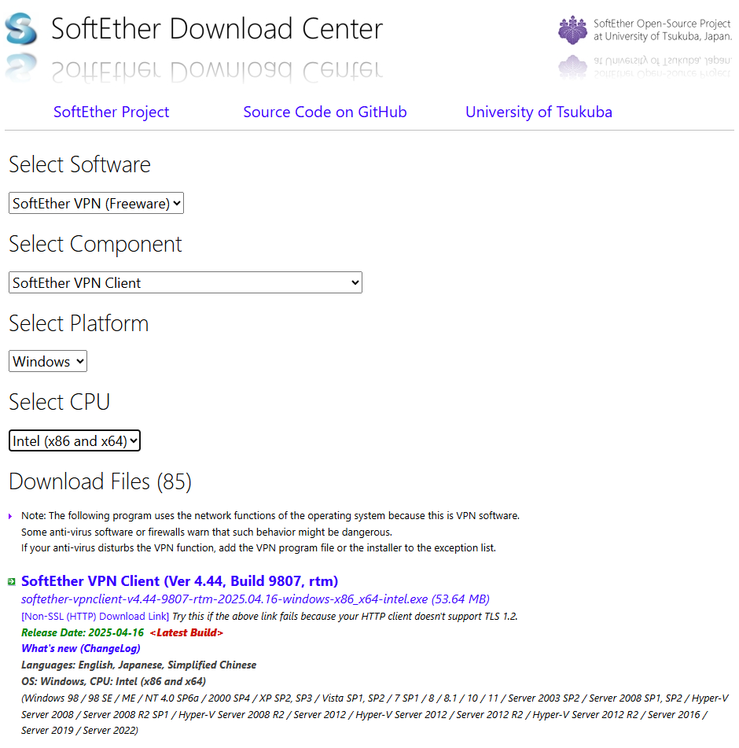
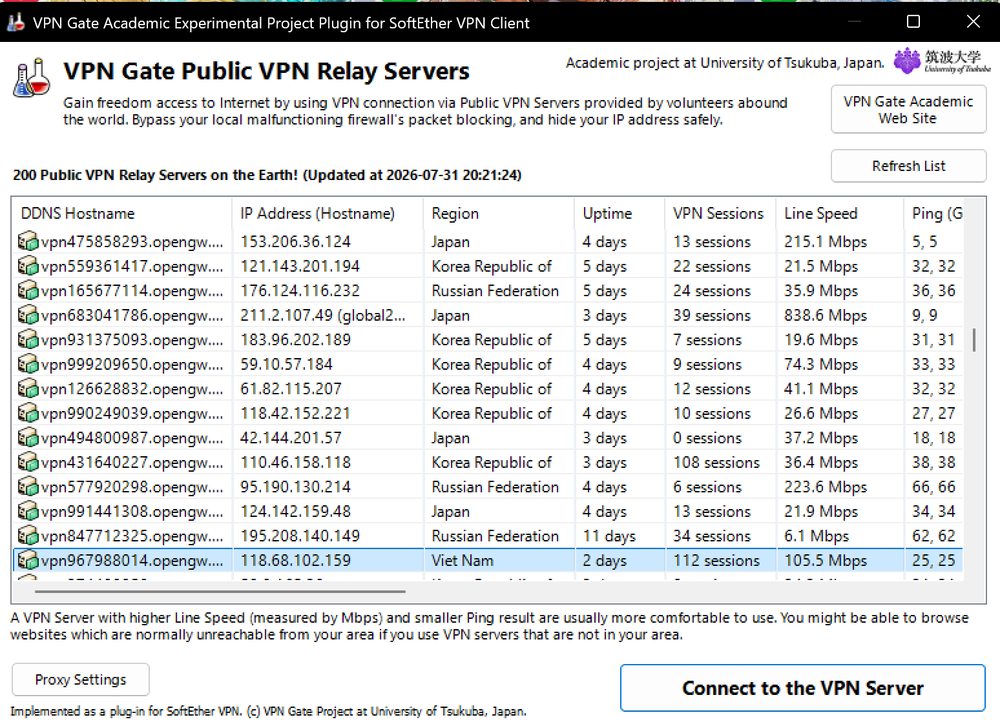

How to Install and Use SoftEther VPN Client on Windows

1. Download and Installation of SoftEther VPN Client
   The initial phase involves obtaining the SoftEther VPN client software and completing the installation with proper options selected.

- Visit the SoftEther download center to download the Windows installer.
- Launch the installer and select the SoftEther VPN Client option among installation choices.
- Proceed through the installation prompts by clicking Next until completion.
- The installer will prompt to create a virtual network adapter during setup — choose Yes when asked.
  

2. Choose VPN Region to Connect (Choose allowed game region like US,japan,etc)
   Choose VPN Gate Public VPN Relay Servers and select your allowed region to connect.

- Can refresh in the top right to renew the server or to find diffrent VPN region/server that you can connect and log in to the game.
  
